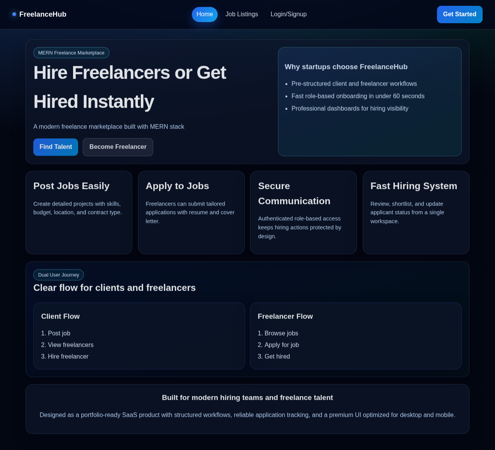

# Freelancer Marketplace

Production-oriented MERN platform where clients post jobs and freelancers submit proposals, track hiring status, and collaborate through project workflows.

> Portfolio positioning: designed to look and feel like a real SaaS hiring product built by a junior-to-mid level MERN developer.

## Features

- JWT authentication with refresh-token support
- Role-based access (Client/Freelancer flow mapped to Employer/Job Seeker roles)
- Job posting, proposal submission, and application status tracking
- Saved jobs and resume upload support
- REST messaging API for client-freelancer communication
- Project lifecycle with simulated payment flow:
  - `pending -> in-progress -> completed -> paid`
- Search, filter, and pagination-ready job listing endpoint
- Professional dashboard UI with stats, activity feed, tables, and responsive layout

## Tech Stack

- Frontend: React, Vite, React Router, Axios
- Backend: Node.js, Express, MongoDB, Mongoose
- Auth/Security: JWT, bcryptjs, cookie-parser
- File Uploads: Multer
- Email: Nodemailer
- Deployment:
  - Frontend: Vercel
  - Backend: Render
  - Database: MongoDB Atlas

## Folder Structure

```text
Freelancer Marketplace/
├── client/
│   ├── src/
│   │   ├── api/
│   │   ├── components/
│   │   ├── context/
│   │   └── pages/
│   └── vercel.json
├── server/
│   ├── src/
│   │   ├── config/
│   │   ├── controllers/
│   │   ├── middleware/
│   │   ├── models/
│   │   ├── routes/
│   │   └── utils/
│   ├── seed.js
│   └── vercel.json
├── screenshots/
├── render.yaml
└── README.md
```

## Installation

```bash
git clone <your-repo-url>
cd "Freelancer Marketplace"
npm install
```

Run both apps in development:

```bash
npm run dev
```

Run separately:

```bash
npm run dev:server
npm run dev:client
```

## Environment Variables

### Root `.env.example`

```env
MONGO_URI=
JWT_SECRET=
PORT=5000
```

### Server (`server/.env`)

```env
PORT=5000
MONGO_URI=<mongodb-uri>
JWT_SECRET=<jwt-secret>
JWT_REFRESH_SECRET=<refresh-secret>
CLIENT_URL=http://localhost:5173
SMTP_HOST=<optional>
SMTP_PORT=<optional>
SMTP_USER=<optional>
SMTP_PASS=<optional>
SMTP_FROM=<optional>
```

### Client (`client/.env`)

```env
VITE_API_URL=http://localhost:5000
```

## Scripts

- `npm run dev` - run client and server concurrently
- `npm run lint` - lint client
- `npm run build` - build client
- `npm run seed` - seed realistic demo data

## API Overview

Base path: `/api`

- Auth
  - `POST /auth/register`
  - `POST /auth/login`
  - `POST /auth/refresh`
  - `POST /auth/logout`
  - `GET /auth/me`
- Jobs
  - `GET /jobs`
  - `GET /jobs/:id`
  - `POST /jobs`
  - `PATCH /jobs/:id/close`
  - `PUT /jobs/:id/save`
- Proposals / Applications
  - `POST /applications/:jobId`
  - `GET /applications/me`
  - `GET /applications/employer/applicants`
  - `PUT /applications/:applicationId/status`
- Messages
  - `POST /messages`
  - `GET /messages?jobId=<id>&participantId=<id>`
- Projects
  - `GET /projects`
  - `PUT /projects/:projectId/status`

## Screenshots

Replace placeholder images in `/screenshots`:

- `screenshots/home-dashboard.png`
- `screenshots/jobs-table.png`
- `screenshots/auth-flow.png`

Markdown example:

```md

```

## Live Demo

- Frontend: `<add-vercel-url-here>`
- Backend API: `<add-render-url-here>`

## Deployment

- Frontend deployment guide: Vercel (`client` root)
- Backend deployment guide: Render (`server` root)
- See: [`DEPLOYMENT.md`](./DEPLOYMENT.md)

## Author

**Abdul Hamid**

- GitHub: [ihamidch](https://github.com/ihamidch)
